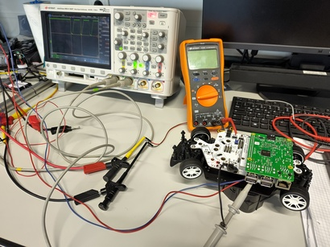

Software Architecture
=====================

.. image:: architecture.svg

Realtime Requirements
---------------------

Obviously, if something can hit the wall, it has realtime
requirements. *The car can hit the wall*.

A multi-process approach has been taken for exactly that reason.
