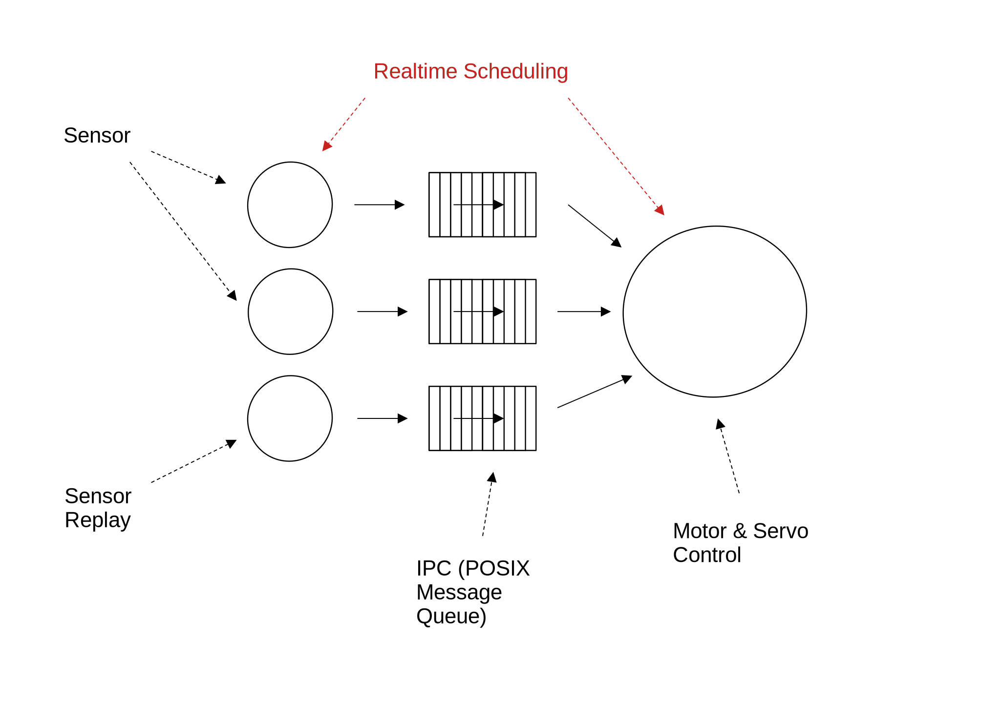

.. include:: <mmlalias.txt>

Crazy Car NG, Running Linux
===========================

.. contents::
   :local:

.. sidebar::

   * Github project: https://github.com/jfasch/FH-STECE2022
   * Github workflow (forks, and pull requests):
     :doc:`jfasch:about/site/work-in-progress/fh-joanneum/2021/git/git`

The Mission
-----------

The bachelor studies `Electronics and Computer Engineering
<https://www.fh-joanneum.at/elektronik-und-computer-engineering/bachelor/en/>`__
has a class `Embedded Computing (1 and 2)
<https://www.fh-joanneum.at/elektronik-und-computer-engineering/bachelor/en/my-studies/curriculum/>`__,
in semester 4 and 5. During this class we want to learn

* C++
* Linux hardware interfaces
* Linux realtime
* Some Python
* ... and more

Also on FH Joanneum, there is a fun contest, `Crazy Car
<https://www.fh-joanneum.at/veranstaltung/crazy-car/>`__. FH Joanneum
is one of the competitors, and as such has hardware (a
car). Traditionally, that car has been equipped with bare metal
software (class `Embedded Systems
<https://www.fh-joanneum.at/elektronik-und-computer-engineering/bachelor/en/my-studies/curriculum/>`__,
semester 3).

In search for something to play with in Embedded Computing 2, we
decided to have fun with the car and a `Raspberry Pi
<https://www.raspberrypi.org/>`__.

Project Goal: Create Toolcase
-----------------------------

Create Linux implementations for the hardware devices that are found
on a car. These implementations should be usable from many possible
architectures, including the reference architecture below, but also
from more static architectures.

* :doc:`project/proximity-vl53l1x`
* :doc:`project/gyroscope-bno055`
* :doc:`project/motor-control-btn9960lv`
* :doc:`project/servo-motor`
* :doc:`project/sysfs-pwm`

**What's to come?**

* Device calibration
* Acceleration ramps on top of motor control
* More such assets on top of the bare hardware

Project Goal: Create Reference Architecture
-------------------------------------------

Given a working toolcase that we can use code out of, a reference
architecture can be implemented. This architecture should be comprised
of components that are loosely coupled for several reasons:

#. Mix languages. For example, use Python for non-realtime
   responsibilities like cloud communication (MQTT)
#. Provide different setups. For example, optionally replay recorded
   sensor inputs into an unmodified steering component - without
   having the hardware sensors available
#. Testability

Project Plan
------------

.. toctree::
   :maxdepth: 1

   project/group

Meetings, Hacking Sessions
--------------------------

.. toctree::
   :maxdepth: 1

   2024-10-08/index
   2024-10-23/index
   2024-10-29/index
   2024-11-05/index

Further Information
-------------------

.. toctree::
   :hidden:
   :maxdepth: 1

   queue

* Crazy Car NG Schematics:
  :download:`Schematic_and_print_CrazyCar.pdf`
* More material: :doc:`queue`
