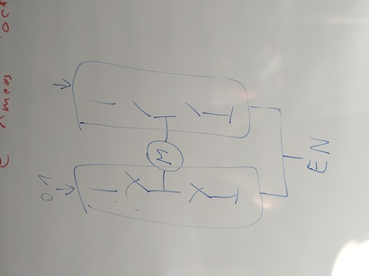

.. ot-task:: crazycar.motor_control_btn9960lv
   :dependencies: crazycar.sysfs_pwm, crazycar.sysfs_gpio

.. include:: <mmlalias.txt>

ACTIVE: Motor Control: BTN9960LV
================================

.. contents::
   :local:

Plan
----

Find out how to operate the two halfbridges on the `BTN9960LV eval
board
<https://www.infineon.com/cms/en/product/evaluation-boards/dc-shield_btn9960lv/>`__.

Using :doc:`sysfs-pwm`, and possibly a class ``SysFSGPIO`` too, write
a class that we can use.

Status
------

* 2024-11-05: ongoing

  * Still unclear: do we need to operate two PWM channels, or is one
    sufficient?
  * Burnt the eval board

Notes
-----

* Evaluation board:
  https://www.infineon.com/cms/en/product/evaluation-boards/dc-shield_btn9960lv/
* Datasheet, docs:
  https://www.infineon.com/cms/de/product/power/motor-control-ics/brushed-dc-motor-control-ics/single-half-bridge-ics/btn9960lv/

