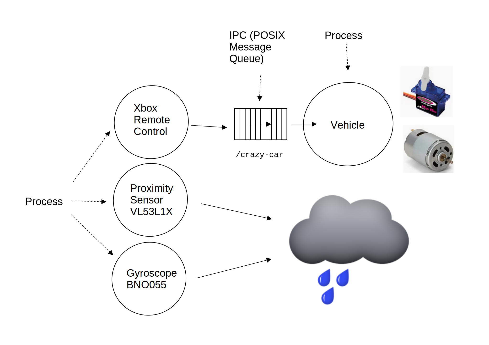

.. ot-task:: crazycar.crazy_car
   :dependencies: crazycar.hardware_init

.. include:: <mmlalias.txt>

(ACTIVE) Crazy Car (Steering App)
=================================

.. contents::
   :local:

Plan
----

Complete `The Crazy Car (bin/crazy-car.cpp)
<https://github.com/jfasch/FH-STECE2022/blob/main/bin/crazy-car.cpp>`__
so that it actually does something. 

I.e., dispatch incoming commands to servo and motor.

